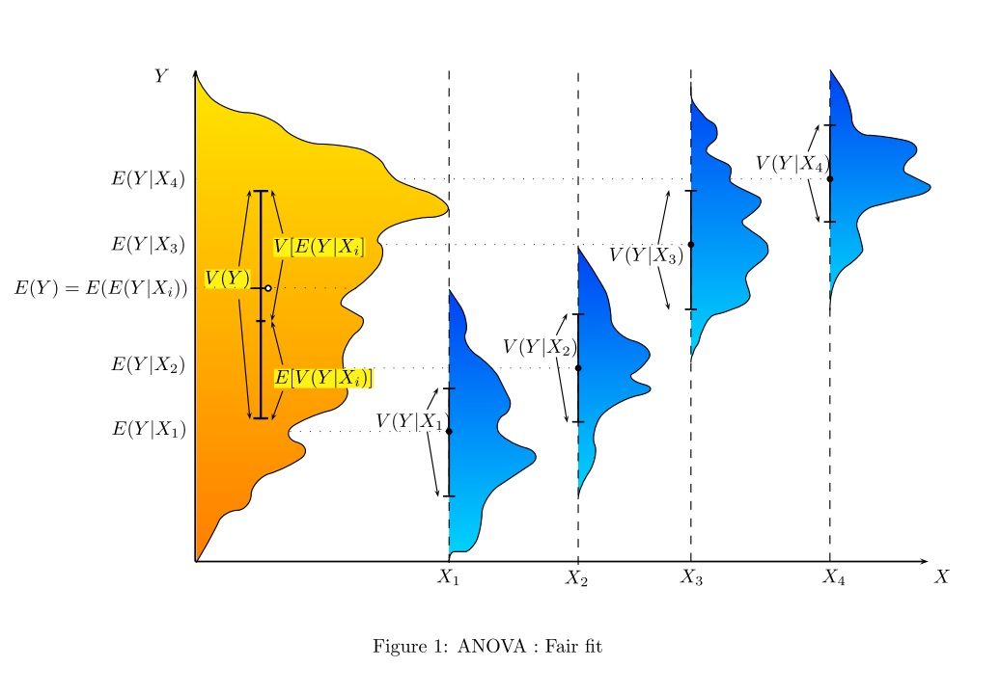

```{r setup, include=FALSE}
options(htmltools.dir.version = FALSE)
knitr::opts_chunk$set(echo = FALSE, fig.align="center", out.width = 600)
library(ggplot2)
library(dplyr)
library(readr)
```

# Lecture 2

- Review of Confidence Intervals

- One-way Analysis of Variance (ANOVA)

```{r, out.width = '600px'}

```

---

# Two-sample z-test

Let $X_1, \dots, X_n \overset{iid}\sim \mathcal{N}(\mu_X, \sigma^2)$ and $Y_1, \dots, Y_m \overset{iid}\sim \mathcal{N}(\mu_Y, \sigma^2)$.

We wish to test

$$\begin{aligned}
&H_0: \mu_X = \mu_Y\\
&H_1: \mu_X \neq \mu_Y
\end{aligned}$$

If $\sigma^2$ is __known__, we can use the two-sample $z$-test, which has test statistic

$$T(X) = \frac{\overline X - \overline Y}{\sigma\sqrt{\frac{1}{n} + \frac{1}{m}}} \overset{H_0}\sim \mathcal{N}(0, 1).$$

---

# Two-sample t-test

Let $X_1, \dots, X_n \overset{iid}\sim \mathcal{N}(\mu_X, \sigma^2)$ and $Y_1, \dots, Y_m \overset{iid}\sim \mathcal{N}(\mu_Y, \sigma^2)$.

We wish to test

$$\begin{aligned}
&H_0: \mu_X = \mu_Y\\
&H_1: \mu_X \neq \mu_Y
\end{aligned}$$

If $\sigma^2$ is __unknown__, we instead use the two-sample $t$-test, with pooled variance estimator $s_p$ calculated as

$$s_p^2 = \frac{(n - 1)s_X^2 + (m - 1)s_Y^2}{m + n - 2}.$$

The test statistic is

$$T(X) = \frac{\overline X - \overline Y}{s_p\sqrt{\frac{1}{n} + \frac{1}{m}}} ~\overset{H_0}\sim~ t(m + n - 2).$$

---

# Two-sample t-test

#### Example A (Rice, p423)

Two methods, A and B, were used in a determination of the latent heat of fusion of ice (Matrella 1963).  The investigators wanted to find out by how much the methods differed.  The data give the change in total heat from ice at $-0.72^{\circ}\text{C}$ to water $0^{\circ}\text{C}$ in calories per gram of mass:

```{r, dpi=320, fig.width=10, fig.height=4}
library(ggplot2)
A <- c(79.98, 80.04, 80.02, 80.04, 80.03, 80.03, 80.04, 79.97, 80.05, 80.03, 80.02, 80.00, 80.02)
B <- c(80.02, 79.94, 79.98, 79.97, 79.97, 80.03, 79.95, 79.97)
dat <- data.frame(value = c(A, B), method = c(rep("A", length(A)), rep("B", length(B))))
ggplot(dat) + 
  geom_boxplot(aes(y = value, x = method)) + 
  geom_point(aes(y = value, x = method, fill = method), alpha = 0.5, size = 4, pch = 21)
```

---

# Two-sample t-test

#### Example A

```{r, echo = TRUE}
A <- c(79.98, 80.04, 80.02, 80.04, 80.03, 80.03, 80.04, 79.97, 80.05, 80.03, 80.02, 80.00, 80.02)
B <- c(80.02, 79.94, 79.98, 79.97, 79.97, 80.03, 79.95, 79.97)
n <- length(A)
m <- length(B)
dat <- data.frame(value = c(A, B), method = c(rep("A", n), rep("B", m)))
dat
```

---

# Two-sample t-test

#### Example A

```{r, echo = TRUE}
library(dplyr)
dat_summary <- dat %>% group_by(method) %>% 
  summarize(mean = mean(value), sd = sd(value))
```

```{r, echo=FALSE}
knitr::kable(dat_summary, format = "html")
```

---

# Two-sample t-test

#### Example A


```{r, echo=TRUE}
s_p <- sqrt(((n - 1) * dat_summary$sd[1]^2 + 
          (m - 1) * dat_summary$sd[2]^2) / (n + m - 2))
print(s_p)
```

```{r, echo=TRUE}
test_stat <- (mean(A) - mean(B)) / (s_p * sqrt(1 / n + 1 / m))
print(test_stat)
```

```{r}
2 * pt(abs(test_stat), df = n + m - 2, lower.tail = FALSE)
```


---

# Two-sample t-test

#### Example A

Using the built-in `R` function:

```{r}
t.test(A, B, var.equal = TRUE)
```

---

# Two-sample t-test

#### Example A

```{r, echo = FALSE, fig.align='center', fig.width=7, fig.height=5}
t_seq <- seq(-4, 4, 0.01)
t_pdf <- dt(t_seq, df = m + n - 2)
curve(dt(x, df = n - 1), from = -4, to = 4, ylab = "t Density", xlab = "x",
      main = "Example A: Two Sample t-test")
polygon(c(t_seq[t_seq <= -test_stat], -test_stat), c(t_pdf[t_seq <= -test_stat], 0), col=rgb(0, 0, 1, 0.6))
polygon(c(t_seq[t_seq >= test_stat], test_stat), c(t_pdf[t_seq >= test_stat], 0), col=rgb(0, 0, 1, 0.6))
abline(v = test_stat, lty = 2)
abline(v = -test_stat, lty = 2)
legend("topright", col = c("blue"), legend = c("P-value"), lty = 1)
```

---

# One-way ANOVA

```{r, echo = T}
I <- 3
J <- 5
mu <- 1
alpha1 <- -0.5
alpha2 <- 2
alpha3 <- 1
sigma <- 0.75
```

```{r, echo = T}
set.seed(12345)
Y1 <- mu + alpha1 + rnorm(J, 0, sigma)
Y2 <- mu + alpha2 + rnorm(J, 0, sigma)
Y3 <- mu + alpha3 + rnorm(J, 0, sigma)
```

---

# One-way ANOVA

```{r}
set.seed(12345)
dat <- data.frame(grp = rep(c(1, 2, 3), each = J), Y = c(Y1, Y2, Y3))
ggplot(dat) + 
  geom_jitter(aes(x = factor(grp), y = Y, fill = factor(grp)), size = 3, pch = 21, color = "black", alpha = 0.75, width = 0.01) + 
  theme(axis.text.x = element_blank()) + 
  xlab("")
```


---

# One-way ANOVA

### Diet and Longevity Study (12.5.33, Rice)

It is hypothesized that animals on restricted calorie diets have longer lifespans on average.  
A study by Weindruch et al. examined the effects of 6 different types of diets on lifespans 
in female mice.

```{r}
dat <- read.csv('dat/datasets/Chapter 12/diet-and-longevity.csv')
```

```{r, fig.height=4}
ggplot(dat) + 
  geom_boxplot(aes(x = DIET, y = LIFETIME))
```

---

# One-way ANOVA

### Diet and Longevity Study (12.5.33, Rice)

We wish to test whether there is a significant difference in the average lifespans across the 
treatment groups.

$$\begin{aligned}
&H_0: \text{All group mean lifespans are equal.}\\
&H_1: \text{At least one group has a different mean lifespan.}
\end{aligned}$$

---

# One-way ANOVA

### Diet and Longevity Study (12.5.33, Rice)

```{r}
dat_summary <- dat %>% group_by(DIET) %>% 
  summarize(mean = mean(LIFETIME), sd = sd(LIFETIME))
knitr::kable(dat_summary, format = 'html')
```

---

# One-way ANOVA

### Diet and Longevity Study (12.5.33, Rice)

```{r}
n <- nrow(dat)
I <- nrow(dat_summary)
```

```{r, echo=TRUE}
SSTOT <- sum((dat$LIFETIME - mean(dat$LIFETIME))^2)
SSTOT
```

```{r, echo=TRUE}
SSW <- 0
for (subj in 1:n) {
  SSW <- SSW + (dat$LIFETIME[subj] - dat_summary$mean[which(dat_summary$DIET == dat$DIET[subj])])^2
}
SSW
```

```{r, echo=TRUE}
SSB <- SSTOT - SSW
SSB
```

---

# One-way ANOVA

### Diet and Longevity Study (12.5.33, Rice)

```{r, echo=TRUE}
MSB <- SSB / (I - 1)
MSB
```

```{r, echo=TRUE}
MSE <- SSW / (n - I)
MSE
```

---

# One-way ANOVA

### Diet and Longevity Study (12.5.33, Rice)

##### F statistic

```{r, echo=TRUE}
test_stat <- MSB / MSE
test_stat
```

##### P-value

```{r, echo=TRUE}
P_val <- pf(test_stat, df1 = I - 1, n - I, lower.tail = FALSE)
P_val
```


---

# One-way ANOVA

### Diet and Longevity Study (12.5.33, Rice)

We wish to test whether there is a significant difference in the average lifespans across the 
treatment groups.

```{r, echo=TRUE}
fit <- lm(LIFETIME ~ DIET, data = dat)
anova(fit)
```


---

# One-way ANOVA

### Linseed Experiment

```{r}
dat <- read_csv("dat/datasets/Chapter 12/linseed.csv")
dat %>% group_by(Variety) %>% summarize(n = n(), mean = mean(Yield), sd = sd(Yield))
```

---

# One-way ANOVA

### Linseed Experiment

```{r}
ggplot(dat) + 
  geom_boxplot(aes(x = Variety, y = Yield, fill = Variety))
```


---

# One-way ANOVA

### Linseed Experiment

```{r}
ggplot(dat) + 
  geom_boxplot(aes(x = Variety, y = Yield, fill = Variety), alpha = 0.5) + 
  geom_point(aes(x = Variety, y = Yield, fill = Variety), pch = 23, size = 3)
```

---

# One-way ANOVA

### Linseed Experiment

```{r, echo = TRUE}
fit <- lm(Yield ~ Variety, data = dat)
anova(fit)
```

